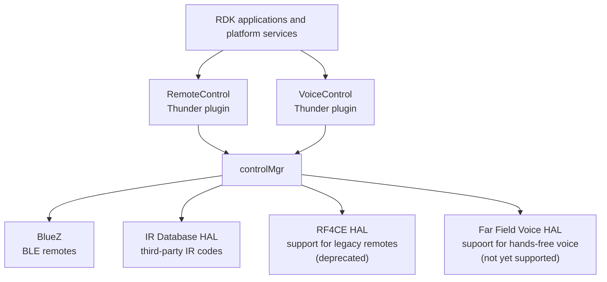

# RDK Control Manager

`rdkcentral/control` provides the Control Manager for RDK-based set-top boxes and smart TV platforms. It coordinates remote controls and their input, voice sessions, device state, configuration, firmware and IR database operations, and integration with platform services.

The main product is the `controlMgr` executable. The project is intended to be built as part of an RDK platform or SDK environment; it is not a standalone desktop application.

## System Context

`controlMgr` exposes its public-facing functionality through the `RemoteControl` and `VoiceControl` Thunder plugins. It uses platform HALs and services to communicate with physical remotes and voice hardware:



The HAL and service integrations are platform-facing implementation dependencies; the Thunder plugins are the primary public interface consumed by the rest of the RDK system. The RF4CE HAL integration is deprecated and is retained for legacy remote support.

## What It Provides

- Remote control management over BLE and RF4CE, including discovery, pairing, key events, device updates, and firmware operations.
- Voice and audio session handling for supported remote-control networks and voice endpoints.
- IR database and IR input support, including platform and vendor integration points.
- Runtime configuration, RFC-backed settings, persistence, validation, and recovery.
- Device power-state handling and integration with RDK services through IARM and Thunder plugins.
- Optional telemetry, authentication, Breakpad, asynchronous messaging, and platform-specific features controlled by CMake options.

See [PRODUCT.md](PRODUCT.md) for a fuller description of product capabilities and [CHANGELOG.md](CHANGELOG.md) for release history.

## Repository Layout

| Path | Purpose |
| --- | --- |
| `src/` | Control Manager implementation and subsystem code |
| `src/ble/` | BLE remote-control support and BLE HAL adapters |
| `src/rf4ce/` | RF4CE remote-control support |
| `src/voice/` | Voice session, audio endpoint, IPC, and telemetry code |
| `src/irdb/` | IR database interfaces and platform stubs |
| `src/thunder/` | Thunder controller, plugins, and platform-service integration |
| `src/config/` | Runtime configuration and configuration attributes |
| `src/database/` | Persistent Control Manager data |
| `src/rfc/` | RFC configuration integration |
| `src/ipc/` | Inter-process communication and event handling |
| `include/` | Public Control Manager, HAL, and IPC interfaces |
| `ci/` | Dependency and CI build scripts |
| `CMakeLists.txt` | Build options, dependencies, targets, and installation rules |

## Building

Builds require an RDK-compatible Linux environment or the corresponding Yocto SDK/container. The project links to platform-provided components such as IARM, Thunder/WPEFramework, BLE and RF4CE libraries, `xr-voice-sdk`, GLib, SQLite, D-Bus, and other RDK libraries. A regular macOS or generic Linux installation does not provide these dependencies by itself.

The top-level CMake project exposes feature flags for platform variants. The principal defaults are BLE enabled, RF4CE enabled, and Thunder enabled:

```sh
cmake -S . -B build \
  -DBUILD_SYSTEM=YOCTO \
  -DCMAKE_BUILD_TYPE=Release
cmake --build build --target controlMgr
cmake --install build --prefix "$DESTDIR"
```

For a native CI build, inspect the scripts in [`ci/`](ci/) and the [native build workflow](.github/workflows/native_full_build.yml). Enable or disable features with CMake options such as `BLE_ENABLED`, `RF4CE_ENABLED`, `THUNDER`, `TELEMETRY_SUPPORT`, `AUTH_ENABLED`, `BREAKPAD`, `XRSR_HTTP`, and `XRSR_SDT`. The exact options and their dependencies are defined in [CMakeLists.txt](CMakeLists.txt).

## Runtime Configuration

The default configuration is defined in [`src/ctrlm_config_default.json`](src/ctrlm_config_default.json), with configuration handling implemented under [`src/config/`](src/config/). The build installs the generated `ctrlm_config.json` into the target system configuration directory. Platform or vendor layers may provide overrides through their RDK integration.

### BLE Network Configuration

The `network_ble` object controls BLE network behavior:

- `options.disable_voice` disables BLE voice handling when set to `true`. It defaults to `false`.
- `timeouts.discovery` is the discovery timeout in milliseconds.
- `timeouts.pair` is the pairing timeout in milliseconds.
- `timeouts.setup` is the remote setup timeout in milliseconds.
- `timeouts.unpair` is the unpair timeout in milliseconds.
- `timeouts.hidrawPoll` is the interval used while polling for the HID raw device, in milliseconds.
- `timeouts.hidrawLimit` is the maximum HID raw-device polling limit, in milliseconds.
- `models` is the list of supported BLE remote models. Each model identifies the remote by its advertised name and describes the GATT services required for the remote to be usable.

Each `models` entry has these fields:

- `name` is the model identifier used by Control Manager.
- `advertisingNames.regexPairing` is the ECMAScript regular expression matched during discovery and pairing.  This is a required field and it needs to match the advertising name.  A regex can be used here for remotes that include unique identifiers in the advertising name, for example `[U][0-9][0-9][0-9] RDK-RCU`
- `advertisingNames.optional.regexReconnect` optionally supplies a different expression for reconnecting to a previously paired remote.  This is useful for models the change advertising name based on paired status or include unique identifier digits, for example `[UP][0-9][0-9][0-9] RDK-RCU`
- `advertisingNames.optional.formatSpecifierTargetedPairing` optionally formats a targeted-pairing name, for example `U%03hhu RDK-RCU`.  This is used for models that include unique identifiers in the name and allows for targetting a specific device for pairing.
- `otaProductName` optionally identifies the product name used by remote firmware updates.
- `standbyMode` optionally selects the infrared standby mode. The supported values are `B` and `C`; an unrecognized or missing value uses the default mode B.  This is only used if the model supports the RDK Infrared GATT service
- `services.type` currently must be `gatt`.
- `services.required` lists GATT services that must be present for the model to be accepted.
- `services.optional` lists GATT services that may be present but are not required.
- `disabled` optionally disables an otherwise defined model.

Service names must be recognized by the BLE service catalog. Common values include `Battery`, `Device Info`, `Immediate Alert`, `RDK Voice`, `RDK Infrared`, `RDK Firmware Upgrade`, and `RDK Remote Control`.

#### Vendor BLE Model Override

The vendor layer can deploy `/etc/vendor/input/ble_remote_whitelist.json` to define the supported model list. This file is a JSON array containing model objects directly; it is not wrapped in a `network_ble` object. When the file is present, it replaces the default `network_ble.models` array, so it should contain every model the product supports, including existing models that must remain enabled.

For example, the following vendor file adds support for an `RDK-RCU` remote that advterises as `U-RDK-RCU`when its unpaired and `P-RDK-RCU` when its paired. In a product that also supports other remotes, include their model objects in the same array:

```json
[
  {
    "name": "RDK-RCU",
    "advertisingNames": {
      "regexPairing": "[U]-RDK-RCU",
      "optional": {
        "regexReconnect": "[UP]-RDK-RCU"
      }
    },
    "services": {
      "type": "gatt",
      "required": [
        "Battery",
        "Device Info",
        "Immediate Alert"
      ],
      "optional": [
        "RDK Voice",
        "RDK Infrared",
        "RDK Firmware Upgrade",
        "RDK Remote Control"
      ]
    }
  }
]
```

BLE options and timeouts can be overridden separately with `/etc/vendor/input/ble_network_options.json` and `/etc/vendor/input/ble_network_timeouts.json`. These files contain the `options` and `timeouts` objects directly, and their properties update the corresponding values from the main configuration.

For example, a vendor can disable BLE voice handling with `/etc/vendor/input/ble_network_options.json`:

```json
{
  "disable_voice": true
}
```

The timeout override file uses milliseconds. This example increases the discovery and pairing windows while retaining the other timeout values:

`/etc/vendor/input/ble_network_timeouts.json`

```json
{
  "discovery": 30000,
  "pair": 30000,
  "setup": 60000,
  "unpair": 20000,
  "hidrawPoll": 20000,
  "hidrawLimit": 65000
}
```

Only the properties that need to change are required in an override file. For example, a vendor changing only the discovery timeout may deploy `{ "discovery": 30000 }`.

## Development

Start with the relevant subsystem under [`src/`](src/) and its public interfaces under [`include/`](include/). Changes should preserve the platform contracts exposed through the HAL, IARM, Thunder, and voice interfaces. Pull requests are built by the repository's GitHub Actions workflows in an RDK CI container.

Contribution requirements are described in [CONTRIBUTING.md](CONTRIBUTING.md). Before contributing, review the repository's [LICENSE](LICENSE) and [NOTICE](NOTICE) files.

## Related Documentation

- [Product functionality](PRODUCT.md)
- [Release history](CHANGELOG.md)
- [Contribution guide](CONTRIBUTING.md)
- [CI build scripts](ci/)
- [GitHub Actions workflows](.github/workflows/)
